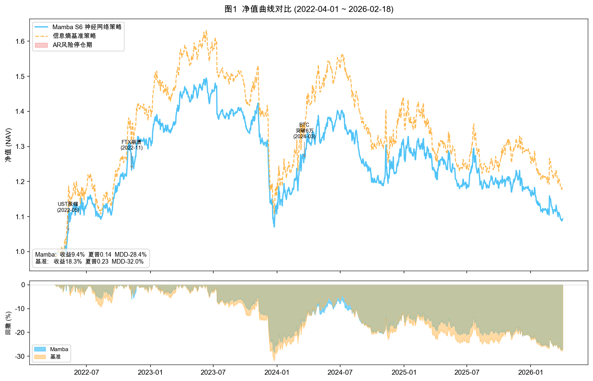
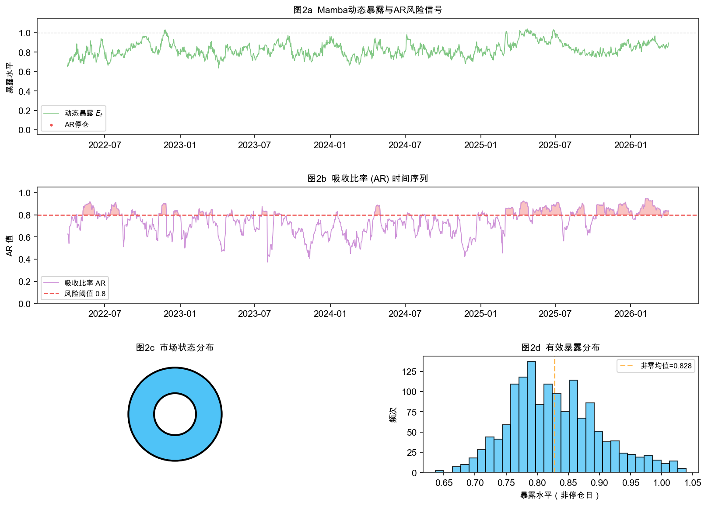

# Mamba S6 for Cryptocurrency Exposure Control

Research code for my Fudan University undergraduate thesis, *Market Timing for
Financial Assets Based on State Space Models*. The system uses a selective
state space model as a portfolio-level risk gate: a cross-sectional strategy
chooses relative asset weights, while Mamba controls total exposure.

> Research and educational software only. This repository is not investment
> advice and is not designed for live order routing.

## What is implemented

- Binance spot and USDT-margined perpetual 1-minute bar downloader with
  resumable local storage.
- Cross-sectional microstructure factor engine with same-day winsorisation,
  z-scoring, and trailing 120-day ICIR weighting.
- Two-layer Mamba S6 network with input-dependent state updates, an exposure
  regression head, and a three-regime classification head.
- Thesis-aligned 40-day sequences, 10-day path-quality labels, four-term
  multi-task objective, and 42-day walk-forward fine-tuning on the latest 126
  observations.
- Four comparable strategies: long-short factor baseline, Mamba long-short,
  equal-weight long-only, and Mamba equal-weight.
- Shared open-to-open backtester with exposure scaling, a 120% daily turnover
  cap, adaptive rebalance bands, minimum trade sizes, maker-limit simulation,
  taker fallback, fees, slippage, and position drift.

## Architecture

```text
Binance 1-minute bars
        |
        v
factor engine + portfolio-state features
        |
        +---------------------> cross-sectional / equal-weight target
        |
        v
40-day state window -> Mamba S6 -> exposure + regime probabilities
        |                                  |
        +----------------------------------+
                           |
                           v
turnover cap -> rebalance band -> maker/taker execution -> NAV
```

## Reported thesis results

Out-of-sample period: **2022-04-01 to 2026-04-03**.

| Strategy | Cumulative return | Annual return | Annual volatility | Sharpe | Max drawdown | Daily turnover |
|---|---:|---:|---:|---:|---:|---:|
| Factor baseline | 18.32% | 4.28% | 18.57% | 0.23 | -32.02% | 15.05% |
| Mamba long-short | 9.35% | 2.25% | 15.84% | 0.14 | -28.42% | 11.88% |
| Equal-weight baseline | -15.38% | -4.08% | 63.35% | -0.06 | -66.45% | 1.67% |
| Mamba equal-weight | 2.17% | 0.54% | 53.23% | 0.01 | -57.44% | 1.63% |

The evidence supports a narrow conclusion: the Mamba overlay improved risk
shape and reduced turnover in these tests, but did not consistently improve
returns.





## Repository layout

```text
.
├── config/factor_sets/       # Factor definitions used by the thesis
├── data_processing/          # Binance download and factor construction
├── models/                   # Selective SSM, Mamba blocks, labels, training
├── strategies/               # Baselines, overlays, execution and backtesting
├── visualization/            # Evaluation tables and figures
├── utils/                    # Device and shared utilities
├── tests/                    # Fast unit tests for paper-critical behavior
├── results/                  # Small, versioned thesis summary only
└── main.py                   # End-to-end research pipeline
```

Raw minute bars, trained weights, and generated outputs are intentionally not
committed. They are large and can be recreated from the public Binance REST
API. Binance availability and symbol history may cause a fresh run to differ
from the archived thesis results.

## Setup

Python 3.10 or newer is recommended.

```bash
python -m venv .venv
source .venv/bin/activate
python -m pip install -r requirements.txt
```

In `main.py`, set `download_data=True` for the first run. Subsequent runs can
reuse local CSV files with `download_data=False`.

```bash
python main.py
```

The default universe contains 12 liquid USDT pairs. The first complete
download is large because it retrieves minute bars from 2021 onward.

## Tests

```bash
python -m pytest -q
```

The tests lock the key paper claims: S6 output shape and exposure bounds,
path-quality label mapping, crash caps and regimes, and dynamic execution
thresholds.

## Reproducibility notes

- Random seeds are fixed to 42.
- Model inputs are standardised using training-window statistics only.
- Strategy state and weights enter the model with a two-day lag.
- Forward returns use the next tradable open-to-open interval.
- Fine-tuning only uses observations available at each walk-forward date.

